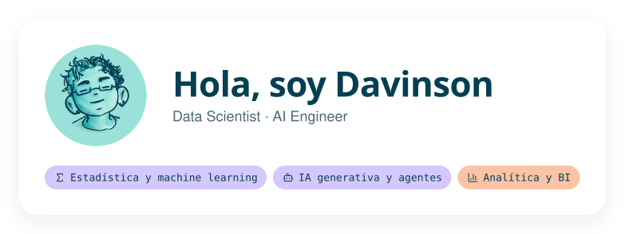

<picture><source media="(prefers-color-scheme: dark)" srcset="assets/intro-dark.svg"></picture>

Estadístico de la Universidad del Valle, en Cali, y estudiante de la Maestría en Ciencia de Datos en ICESI. Trabajo con análisis de datos, modelos de machine learning y agentes de IA, y estoy abierto a roles de Data Analyst, Data Scientist o AI Engineer.

<a href="mailto:arteagadavinson@gmail.com"><picture><source media="(prefers-color-scheme: dark)" srcset="assets/contact-escribir-un-correo-dark.svg"></picture></a>
<a href="https://linkedin.com/in/davinson-arteaga"><picture><source media="(prefers-color-scheme: dark)" srcset="assets/contact-ver-linkedin-dark.svg"></picture></a>
<a href="https://wa.me/573157032101"><picture><source media="(prefers-color-scheme: dark)" srcset="assets/contact-abrir-whatsapp-dark.svg"></picture></a>

## Stack y herramientas

**Lenguajes y datos** 
<picture><source media="(prefers-color-scheme: dark)" srcset="assets/stack-lenguajes-y-datos-dark.svg"></picture>

**IA generativa** 
<picture><source media="(prefers-color-scheme: dark)" srcset="assets/stack-ia-generativa-dark.svg"></picture>

**Machine learning** 
<picture><source media="(prefers-color-scheme: dark)" srcset="assets/stack-machine-learning-dark.svg"></picture>

**BI y visualización** 
<picture><source media="(prefers-color-scheme: dark)" srcset="assets/stack-bi-y-visualizacion-dark.svg"></picture>

**Plataformas y herramientas** 
<picture><source media="(prefers-color-scheme: dark)" srcset="assets/stack-plataformas-y-herramientas-dark.svg"></picture>

## Certificaciones

<a href="https://www.credly.com/badges/dd83bed0-88a8-4cc8-bdea-702b794d8e25/public_url"><picture><source media="(prefers-color-scheme: dark)" srcset="assets/cert-dp-900-dark.svg"></picture></a>
<a href="https://www.hackerrank.com/certificates/f3d20ca33ed3"><picture><source media="(prefers-color-scheme: dark)" srcset="assets/cert-hackerrank-sql-dark.svg"></picture></a>

