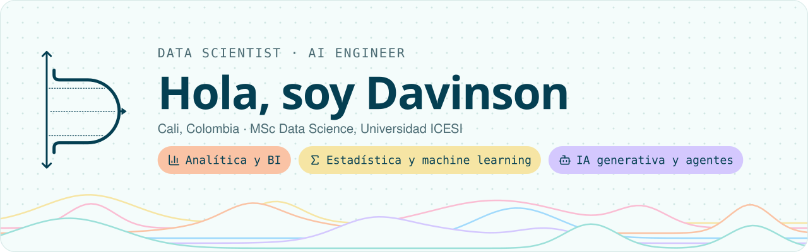

<picture><source media="(prefers-color-scheme: dark)" srcset="assets/header-dark.svg"></picture>

## Sobre mí

- Estadístico de la Universidad del Valle; curso la Maestría en Ciencia de Datos en la Universidad ICESI.
- Construyo consultas SQL avanzadas, conciliaciones financieras y pipelines de reportes automatizados sobre NetSuite (SuiteQL).
- Desarrollo agentes de IA con tool use, MCP servers y RAG.
- Hago consultoría independiente en análisis estadístico, BI y visualización, y modelado.

## Stack y herramientas

**Lenguajes** 
<picture><source media="(prefers-color-scheme: dark)" srcset="assets/stack-lenguajes-dark.svg"></picture>

**IA y machine learning** 
<picture><source media="(prefers-color-scheme: dark)" srcset="assets/stack-ia-y-machine-learning-dark.svg"></picture>

**Datos y plataformas** 
<picture><source media="(prefers-color-scheme: dark)" srcset="assets/stack-datos-y-plataformas-dark.svg"></picture>

**BI y visualización** 
<picture><source media="(prefers-color-scheme: dark)" srcset="assets/stack-bi-y-visualizacion-dark.svg"></picture>

**Infraestructura** 
<picture><source media="(prefers-color-scheme: dark)" srcset="assets/stack-infraestructura-dark.svg"></picture>

## Certificaciones

- [Microsoft Certified: Azure Data Fundamentals (DP-900)](https://www.credly.com/badges/dd83bed0-88a8-4cc8-bdea-702b794d8e25/public_url)
- HackerRank: SQL (Advanced)

## Contacto

<a href="mailto:arteagadavinson@gmail.com"><picture><source media="(prefers-color-scheme: dark)" srcset="assets/contact-escribir-un-correo-dark.svg"></picture></a>
<a href="https://linkedin.com/in/davinson-arteaga"><picture><source media="(prefers-color-scheme: dark)" srcset="assets/contact-ver-linkedin-dark.svg"></picture></a>
<a href="https://wa.me/573157032101"><picture><source media="(prefers-color-scheme: dark)" srcset="assets/contact-abrir-whatsapp-dark.svg"></picture></a>

